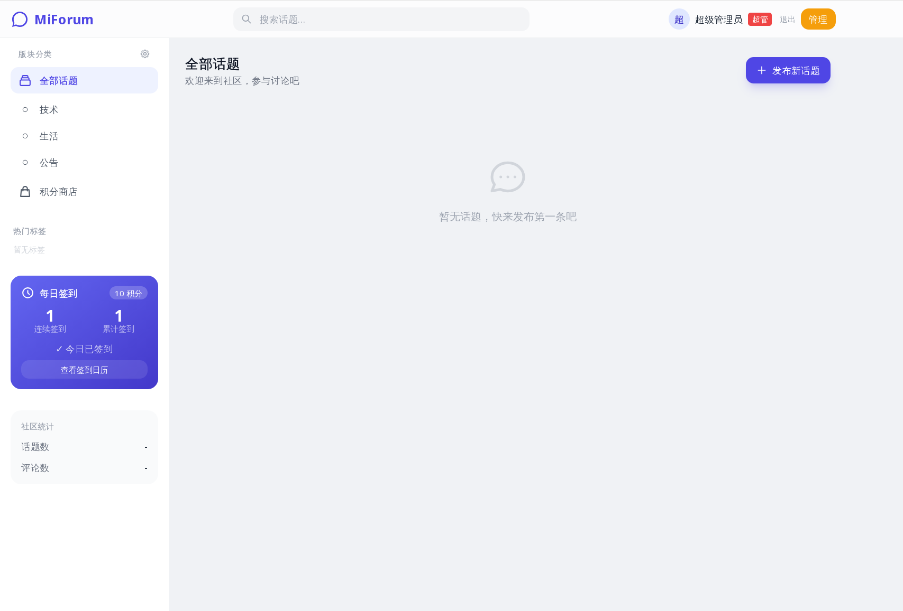

# MiForum

Flarum 风格的轻量论坛，Node.js + Express 后端，SQLite 数据库，开箱即用。



## 灵感来源

- [Flarum](https://github.com/flarum/flarum) — UI 设计风格
- [Discourse](https://github.com/discourse/discourse) — 社区交互模式
- [NodeBB](https://github.com/NodeBB/NodeBB) — 项目结构参考

## 功能

- 注册 / 登录 / 退出（bcryptjs 加密，session 持久化）
- 自动签到（打开网页即签到，每日 +10 积分）
- 签到日历（月历视图，月份选择器，今天按钮，翻页动画）
- 积分补签（注册日至昨天之间的未签日期，每次消耗 10 积分）
- 个人资料（头像裁剪预览、简介、所在地、网站、隐私开关）
- 发帖（技术 / 生活 / 公告分类，多图片上传最多 30 张，10MB/张）
- 帖子新标签页完整展示，图片 lightbox 弹窗预览
- 帖子编辑 / 删除（作者可操作，支持增删图片）
- 评论（支持图片最多 3 张，楼层号，楼主标签，帖主置顶）
- 评论编辑 / 删除（作者可操作，帖主可删任意评论）
- 点赞 toggle + TA的点赞列表
- 收藏功能 + TA的收藏列表
- 搜索 + 分类筛选 + 标签筛选
- 三级权限体系（超级管理员 / 管理员 / 普通用户）
- 超级管理员：授权/撤销管理员、转让超管、用户管理
- 管理员：禁言/解禁用户、删帖、删评论、置顶帖子
- 积分系统（签到 +10，发帖 +5，补签 -10）
- 积分商店（称号、头像框、改名卡，兑换即生效）
- 活跃度等级系统（Lv1~Lv10，星星→月亮→太阳→皇冠）
- 经验值系统（注册+50、签到+10、发帖+20、评论+5）
- 装备系统（称号/头像框切换）
- 等级排行榜
- 关于页面（版本信息、检查更新、自动更新）
- 响应式布局（Tailwind CSS，适配手机和桌面）
- PWA 支持（theme-color、apple-mobile-web-app）
- 分页加载（帖子/评论/收藏列表）
- 安全加固（helmet、速率限制、CSRF 防护、CSP、SMTP 加密）
- 单元测试（jest + supertest）
- 环境变量管理（dotenv）
- Docker 支持（一键部署）
- CI/CD（GitHub Actions）
- 端口占用自动杀旧进程重启

## 快速开始

### 方式一：直接运行

```bash
# 安装依赖
npm install

# 启动服务
npm start

# 开发模式（自动重启）
npm run dev
```

### 方式二：Docker 部署

```bash
# 构建镜像
docker build -t miforum .

# 运行容器
docker run -d \
  -p 3000:3000 \
  -v ./data:/data \
  -e SESSION_SECRET=your-secret \
  miforum
```

### 方式三：Docker Compose

```bash
# 创建 .env 文件
echo "SESSION_SECRET=your-secret" > .env

# 启动
docker-compose up -d

# 停止
docker-compose down
```

浏览器打开 http://localhost:3000

超级管理员：`root@miforum.local` / `123456`

**首次登录请立即修改密码！**

## 技术栈

- **前端**: HTML + Tailwind CSS + 原生 JavaScript
- **后端**: Node.js + Express.js + bcryptjs + express-session + multer
- **数据库**: SQLite（better-sqlite3，单文件存储，支持事务）

## 项目结构

```
├── src/                        # 后端源码
│   ├── server.js               # 主入口
│   ├── database.js             # 数据库初始化
│   ├── controllers/            # 业务控制器
│   │   ├── auth.js             # 认证（注册/登录/退出）
│   │   ├── posts.js            # 帖子 CRUD
│   │   ├── comments.js         # 评论 CRUD
│   │   ├── checkin.js          # 签到系统
│   │   ├── likes.js            # 点赞/收藏
│   │   ├── shop.js             # 积分商店
│   │   ├── level.js            # 经验值/等级
│   │   ├── profile.js          # 个人资料
│   │   └── admin.js            # 管理员操作
│   ├── middleware/             # 中间件
│   │   └── auth.js             # 认证/权限中间件
│   └── utils/                  # 工具函数
│       ├── helpers.js
│       ├── email.js
│       └── upload.js
│
├── public/                     # 前端静态文件
│   ├── forum.html              # 首页
│   ├── post.html               # 帖子详情
│   ├── profile.html            # 个人资料
│   ├── shop.html               # 积分商店
│   ├── js/
│   │   └── common.js           # 公共函数
│   └── css/
│       └── tailwind.css
│
├── docs/                       # 文档
│   ├── API.md
│   ├── CHANGELOG.md
│   └── TEST.md
│
├── .github/                    # CI/CD
│   └── workflows/
│       ├── ci.yml              # 测试 CI
│       └── docker.yml          # Docker 构建
│
├── Dockerfile                  # Docker 镜像
├── .dockerignore               # Docker 排除文件
├── docker-compose.yml          # Docker Compose
├── .eslintrc.json              # ESLint 配置
├── .gitignore
├── README.md
└── package.json
```

## API

详见 [docs/API.md](./docs/API.md)

**API 概览（46 个接口）**

| 模块 | 接口数 | 说明 |
|------|--------|------|
| 认证 | 4 | 注册、登录、退出、当前用户 |
| 帖子 | 5 | CRUD、列表 |
| 评论 | 5 | CRUD、置顶 |
| 签到 | 5 | 自动签到、历史、补签 |
| 点赞/收藏 | 7 | 点赞、取消、列表、收藏 |
| 商店 | 6 | 商品、兑换、装备、卸下 |
| 等级 | 1 | 排行榜 |
| 用户 | 4 | 资料、修改、帖子、点赞 |
| 管理员 | 16 | 用户/帖子/分类管理 |

## 开发

```bash
# 代码规范检查
npm run lint

# 自动修复
npm run lint:fix
```

## 分工

| 开发者 | 负责模块 |
|--------|----------|
| **parkes-mimir** | server.js、posts、comments、shop、profile |
| **jxwzx** | likes、level |
| **phppi561** | checkin、admin |

## 更新日志

详见 [docs/CHANGELOG.md](./docs/CHANGELOG.md)

**最新版本 v1.1.2** — 私密帖子、帖子排序、移动端搜索框

## 贡献者

- **parkes-mimir** — 项目发起、需求设计、核心功能
- **phppi561** — 签到时区修复、管理员功能
- **jxwzx** — 收藏功能、等级系统

## 声明

本项目由 AI 辅助编写，人类提供需求和测试反馈。MIT License。
